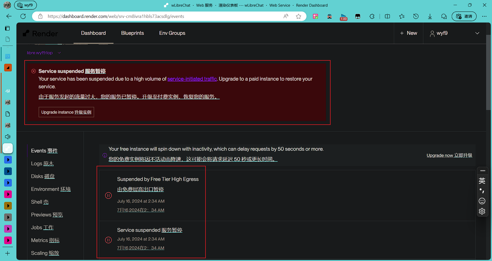

# wyf9sLibreChat

> 本页短链: <https://t.wyf9.top/libredoc>

?> 站点: <https://libre.wyf9.top>

~~服务监测: ~~

## Problems

!> 因国内访问过慢已放弃维护

!> 仍可使用，但因为使用的是免费服务，可能会出现下面的提示:

```text
This service has been suspended.
```

Render Dashboard 的提示:



此问题目前无法解决

## 推荐

推荐一个 AI 聚合站: <https://chatnio.net>

## 注册

点击 `注册`, 按照提示注册即可


## 登录

现支持两种登录方式:

- 邮箱登录
- 三方登录

三方登录可选择 `GitHub` 或 `Discord` 登录或注册, 默认将登录三方账号绑定的邮箱对应账号, 没有将会自动注册

## 手机版应用

为方便安卓用户使用, 特打包了安卓安装包

下载地址: 

<!-- tabs:start -->

##### **raw**

https://ghsrc.wyf9.top/dl/wlibrechat/wLibreChat_WebReleaseLatest.apk

##### **org**

https://ghproxy.org/https://raw.githubusercontent.com/wyf01239/ghsrc/main/dl/wlibrechat/wLibreChat_WebReleaseLatest.apk

> 或使用短链: <https://t.wyf9.top/libreapkorg>

<!-- tabs:end -->

?> 如需下载其他版本,请讲 `Latest` 替换为对应版本号

> 列表: https://github.com/wyf01239/ghsrc/tree/main/dl/wlibrechat

### 常见问题

显示类似如下内容?:

```
网页无法打开
位于 https://libre.wyf9.top/ 的网页无法加载，因为：

net::ERR_CONNECTION_RESET
```

网络线路不稳定, 请 `更换网络/DNS` 或 `使用梯子` 后重试，或刷新页面试试 *(直接在后台程序页面杀掉进程并重开即可)*

> 也可能是你网没了，不过错误代码不是 `ERR_CONNECTION_RESET`

### 打包参数

<!-- tabs:start -->

##### **→**

##### **Here**

```yaml
名称: wLibreChat
包名: top.wyf.web.wlibrechat
版本名: WebRelease1.1
数字版本号: 2
网页: https://libre.wyf9.top
特性: 支持打开外部应用, 硬件加速
启用应用栏/网页标题/菜单项: False
```

<!-- tabs:end -->

## 找回密码

?

## 使用

登录后应该会看到如下界面:


<!-- tabs:start -->

#### **→**

##### **1/2**

............

##### **3-设置 API Key 看**

切换服务商, 有 `OpenAI`、`New Bing`、`Claude`(`Anthropic`) 可选

?> `OpenAI` 的反代 API 已被设为 [ChatNio][chatnio] 的中转 API, 比 OpenAI 增加了更多模型且更便宜

!> 除 `OpenAI` 以外的提供商未测试可用性


打开后会出现如图界面, 点击红框区域可输入 API Key:


`Expires in ...` 可设置密钥存储的过期时间

| English    | 中文 |
|------------|------|
| seconds    | 分钟 |
| hours      | 小时 |
| day / days | 天   |

##### **4**

点击切换模型

##### **5**

高级设置

##### **6**

点击打开用户菜单，可在这里 登出 / 导出对话 等, 设置中可自定义头像

##### **7**

输入框, 回车发送

> 左侧的附件貌似仅能上传四种格式的图片: `JPEG`, `JPG`, `PNG`, `WEBP`, 非 Vision 模型不可用, **未测试可用性**

<!-- tabs:end -->

## 关于 API Key

可以按照以下步骤获取 API Key:

1. 打开 [ChatNio][chatnio] 官网
2. 注册或登录一个账号
3. 点击左下角的三点或右上角的头像, 打开菜单


4. 点击 `API 设置`


5. 复制 API key


6. 按照[上面](#使用)的说明粘贴, 即可开始使用

<!-- tabs:end -->

## 关于模型

?> 最新模型列表及计费: [Here][chatnio-models]

<!-- tabs:start -->

##### **→**

##### **模型列表**

本站目前添加的模型如下:

```py

# ChatGPT ----------,
gpt-3.5-turbo,
gpt-3.5-turbo-1106,
gpt-3.5-turbo-16k,
gpt-4,
gpt-4-1106-preview,
gpt-4-0125-preview,
gpt-4-turbo-preview,
gpt-4-vision-preview,
gpt-4-v,
gpt-4-dalle,
gpt-4-all,
gpt-4-32k,
azure-gpt-3.5-turbo,
azure-gpt-3.5-turbo-16k,
azure-gpt-4,
azure-gpt-4-32k,
gpt-3.5-turbo-fast,
gpt-3.5-turbo-16k-fast,

# ChatGPT-联网 ----------,
web-gpt-3.5-turbo,
web-gpt-3.5-turbo-1106,
web-gpt-3.5-turbo-16k,
web-gpt-4,
web-gpt-4-1106-preview,
web-gpt-4-0125-preview,
web-gpt-4-turbo-preview,
web-gpt-4-vision-preview,
web-gpt-4-v,
web-gpt-4-dalle,
web-gpt-4-all,
web-gpt-4-32k,
web-azure-gpt-3.5-turbo,
web-azure-gpt-3.5-turbo-16k,
web-azure-gpt-4,
web-azure-gpt-4-32k,
web-gpt-3.5-turbo-fast,
web-gpt-3.5-turbo-16k-fast,

# 画图 ----------,
dalle,
dall-e-2,
dall-e-3,
midjourney,
midjourney-fast,
midjourney-turbo,
stable-diffusion,

# Claude ----------,
claude-1-100k,
claude-1,
claude-1.3,
claude-2,
claude-2.1,

# 讯飞星火 ----------,
spark-desk-v1.5,
spark-desk-v2,
spark-desk-v3,

# ChatGLM ----------,
zhipu-chatglm-turbo,

# 通义千问 ----------,
qwen-plus,
qwen-plus-net,
qwen-turbo,
qwen-turbo-net,

# Gemini/PaLM2 ----------,
chat-bison-001,
gemini-pro, 
gemini-pro-vision,

# NewBing ----------,
bing-creative,
bing-balanced,
bing-precise,

# MetaLLaMa ----------,
llama-2-70b,
code-llama-34b,
llama-2-13b,
llama-2-7b,
code-llama-13b,
code-llama-7b,

# 腾讯混元 ----------,
hunyuan,

# 360智脑 ----------,
360-gpt-v9,

# 百川AI ----------,
baichuan-53b,

# 火山方舟(抖音豆包) ----------,
skylark-lite-public,
skylark-plus-public,
skylark-pro-public,
skylark-chat


# ↓OPENAI_MODELS 变量

# ChatGPT ----------,gpt-3.5-turbo,gpt-3.5-turbo-1106,gpt-3.5-turbo-16k,gpt-4,gpt-4-1106-preview,gpt-4-0125-preview,gpt-4-turbo-preview,gpt-4-vision-preview,gpt-4-v,gpt-4-dalle,gpt-4-all,gpt-4-32k,azure-gpt-3.5-turbo,azure-gpt-3.5-turbo-16k,azure-gpt-4,azure-gpt-4-32k,gpt-3.5-turbo-fast,gpt-3.5-turbo-16k-fast,# ChatGPT-联网 ----------,web-gpt-3.5-turbo,web-gpt-3.5-turbo-1106,web-gpt-3.5-turbo-16k,web-gpt-4,web-gpt-4-1106-preview,web-gpt-4-0125-preview,web-gpt-4-turbo-preview,web-gpt-4-vision-preview,web-gpt-4-v,web-gpt-4-dalle,web-gpt-4-all,web-gpt-4-32k,web-azure-gpt-3.5-turbo,web-azure-gpt-3.5-turbo-16k,web-azure-gpt-4,web-azure-gpt-4-32k,web-gpt-3.5-turbo-fast,web-gpt-3.5-turbo-16k-fast,# 画图 ----------,dalle,dall-e-2,dall-e-3,midjourney,midjourney-fast,midjourney-turbo,stable-diffusion,# Claude ----------,claude-1-100k,claude-1,claude-1.3,claude-2,claude-2.1,# 讯飞星火 ----------,spark-desk-v1.5,spark-desk-v2,spark-desk-v3,# ChatGLM ----------,zhipu-chatglm-turbo,# 通义千问 ----------,qwen-plus,qwen-plus-net,qwen-turbo,qwen-turbo-net,# Gemini/PaLM2 ----------,chat-bison-001,gemini-pro, gemini-pro-vision,# NewBing ----------,bing-creative,bing-balanced,bing-precise,# MetaLLaMa ----------,llama-2-70b,code-llama-34b,llama-2-13b,llama-2-7b,code-llama-13b,code-llama-7b,# 腾讯混元 ----------,hunyuan,# 360智脑 ----------,360-gpt-v9,# 百川AI ----------,baichuan-53b,# 火山方舟(抖音豆包) ----------,skylark-lite-public,skylark-plus-public,skylark-pro-public,skylark-chat
```

<!-- tabs:end -->

### 充值

请自行前往 ChatNio 的[官方网站][chatnio]充值使用，本站不进行计费

常见问题解答: [Here][chatnio-qa]

!> 不要泄露自己的 API Key, 避免盗用! 如泄露请在 [ChatNio][chatnio] 获取 `API Key` 的页面重置!

[chatnio-models]: https://docs.chatnio.net/ai-mo-xing-ji-ji-fei
[chatnio]: https://chatnio.net
[chatnio-qa]: https://docs.chatnio.net/chang-jian-wen-ti-jie-da
